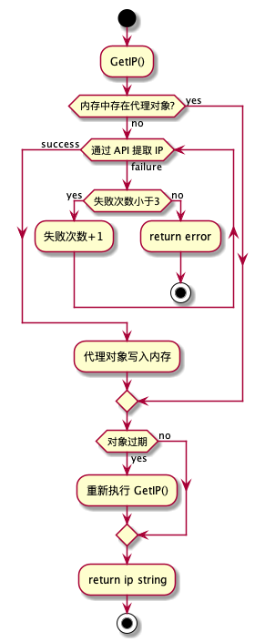

<h1 align="center">zhima - 使用芝麻代理</h1>

方便在 golang 项目中使用[芝麻代理](http://h.zhimaruanjian.com/)获取代理 IP。

**先去芝麻HTTP注册账号。根据自己的使用情况充值一波。**

在个人中心添加 IP 白名单，否则取不到结果。**芝麻HTTP** 是根据请求 IP 来关联账户进行余额消耗的。获取 IP 不收费，使用才收费。

目前只支持一次获取 1 个 IP，IP 的有效时长固定为 25 分钟至 3 小时，代理形式是 HTTP。

## 参数

为了个人项目使用方便，仅支持以下参数：

| 名称    | 说明                                        |
| ------- | ------------------------------------------- |
| pro     | 省份，0 默认全国                              |
| city    | 城市，0 默认全国                              |
| yys     | 0:不限 100026:联通 100017:电信              |
| mr      | 去重选择（1:360天去重 2:单日去重 3:不去重） |
| pb      | 端口位数（4:4位端口 5:5位端口）             |

不支持的参数：

| 名称    | 说明                                          |
| ------- | --------------------------------------------- |
| num     | 提取IP数量                                    |
| regions | 全国混拨地区                                  |
| port    | IP协议 1:HTTP 2:SOCK5 11:HTTPS                |
| time    | 稳定时长 1: 5分钟-25分钟 2: 25分钟-3小时      |
| type    | 数据格式：1:TXT 2:JSON 3:html                 |
| pack    | 用户套餐ID                                    |
| ts      | 是否显示IP过期时间: 1显示 2不显示             |
| ys      | 是否显示IP运营商: 1显示                       |
| cs      | 否显示位置: 1显示                             |
| lb      | 分隔符(1:\r\n 2:/br 3:\r 4:\n 5:\t 6 :自定义) |
| sb      | 自定义分隔符                                  |

## HowTo
